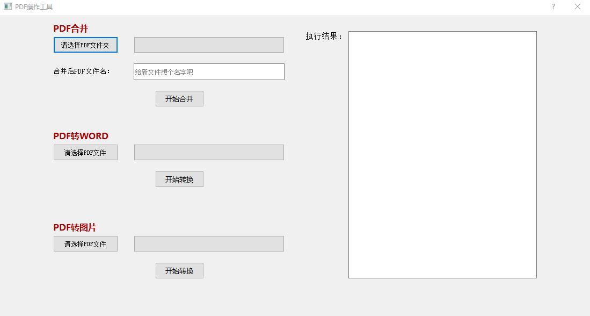
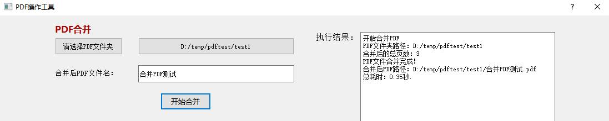
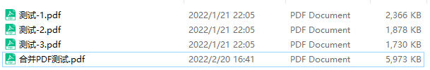
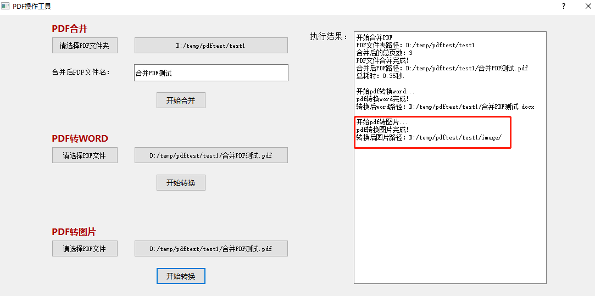
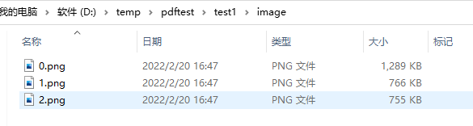

# pdftools
## 1、实现功能：
多个PDF文件合并、PDF转WORD、PDF转图片
## 2、写这个工具的缘由：
有天我对象突然给我抱怨（在使用一款pdf工具），现在合并个PDF都要收那么多钱，都掉钱眼里了。我听了仔细一看，好家伙这么个小功能都要搞各种会员制，按月按年收费。随即我就让我对象等了会儿，用python写了个简单的PDF合并功能。然后抽空又添加了PDF转WORD、PDF转图片的功能。为了让我对象更好的傻瓜式操作就用PyQt5顺手加了界面操作，本来想直接打包成exe，不过打包后文件太大，就直接给我对象在桌面搞了个快捷键，用的时候直接双击打开就行，反正我对象用了之后就没任何怨言了。
## 3、运行环境：
python3.6 + win10
## 4、使用前准备：
执行命令：pip install -r requirements.txt
## 5、使用介绍：
直接执行PDF工具.vbs，打开操作页面。

总体效果图：

PDF合并功能：
选择PDF所在文件夹，给合并后的pdf文件起个名字，点击开始合并：

合并后结果：

PDF转WORD功能:
选择PDF文件，点击开始转换：

转换后结果：

PDF转图片功能：
选择PDF文件，点击开始转换，结果存放在image目录下：

转换后结果：

